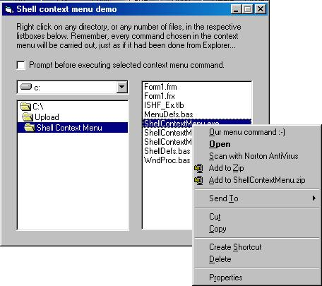



## System Shell Context Menu in your Program

### Description

How to incorporate the Windows Shell Context Menu (the one that appears when you right-click on files, etc) in your programFound this on the WEB, and id like to share it with you. The original author is in the comments. Modified some. Enjoy!
 
### More Info
 

             |
---                |---
**Submitted On**   |2000-04-19 22:18:30
**By**             |[linda samson](https://github.com/Planet-Source-Code/PSCIndex/blob/master/ByAuthor/linda-samson.md)
**Level**          |Intermediate
**User Rating**    |4.5 (36 globes from 8 users)
**Compatibility**  |VB 5\.0, VB 6\.0
**Category**       |[Windows API Call/ Explanation](https://github.com/Planet-Source-Code/PSCIndex/blob/master/ByCategory/windows-api-call-explanation__1-39.md)
**World**          |[Visual Basic](https://github.com/Planet-Source-Code/PSCIndex/blob/master/ByWorld/visual-basic.md)
**Archive File**   |[CODE\_UPLOAD49574192000\.zip](https://github.com/Planet-Source-Code/linda-samson-system-shell-context-menu-in-your-program__1-7391/archive/master.zip)

